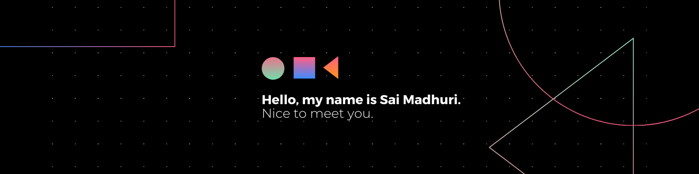

   

# 💫 About Me:
<i></i>Programmer / Open Source Contributor / Web Developer</i>  I am an Undergraduate student pursuing Computer Science Engineering from IIIT Gwalior. As a passionate tech enthusiast, I thrive on exploring the ever-evolving world of technology and immersing myself in the latest innovations.  🌐 Currently exploring the realms of Web Development. ❤ Open Source Contributor. 💫 Ranked among the top 200 contributors in GSSoC'24 with 15+ PRs merged and gaining 6 badges of accomplishment. 📚 Constantly learning and staying up-to-date with the latest tech trends. 📫 Reach out to me at: Linkedin, LeetCode and GitHub. Happy Learning! 👩🏻‍💻✨

## 🌐 Socials:
 

# 💻 Tech Stack:
                          
# 📊 GitHub Stats:
 
 

### 🔝 Top Contributed Repo

<!-- Proudly created with GPRM ( https://gprm.itsvg.in ) -->

