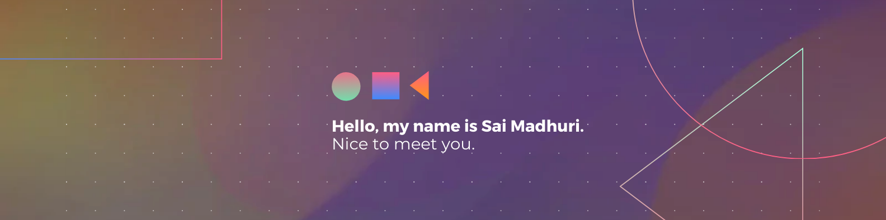

   

<!--Header Name-->
#  About Me: 
*Programmer / Open Source Contributor / Web Development*
  

<!--Start Intro-->               

I am an Undergraduate student pursuing Computer Science Engineering  
  from IIIT Gwalior. As a passionate tech enthusiast, I thrive on exploring the  
  ever-evolving world of technology and immersing myself in the latest innovations.

- 🌐 Currently exploring the realms of Web Development.
- ❤ Open Source Contributor.
- 💫 Selected as a contributor for the Prestiguous GSSoC'24 program.
- 📚 Constantly learning and staying up-to-date with the latest tech trends.
- 📫 Feel free to reach out at: [Linkedin](https://www.linkedin.com/in/sai-madhuri-bodapati/) and [GitHub](https://github.com/Madhuri36). 

Happy Learning! 👩🏻‍💻✨ 

<!--End Intro-->

# 💻 Tech Stack:
                         
 

## GSSOC'24 Badges 🪶

  
  
  
  
  
  <!--
  
  </a> -->

# 📊 GitHub Stats:
| GitHub Stats | GitHub Streak Stats |
| --- | --- |
|  |  |

| Top Languages | Contributor Stats |
| --- | --- |
|  |  |

